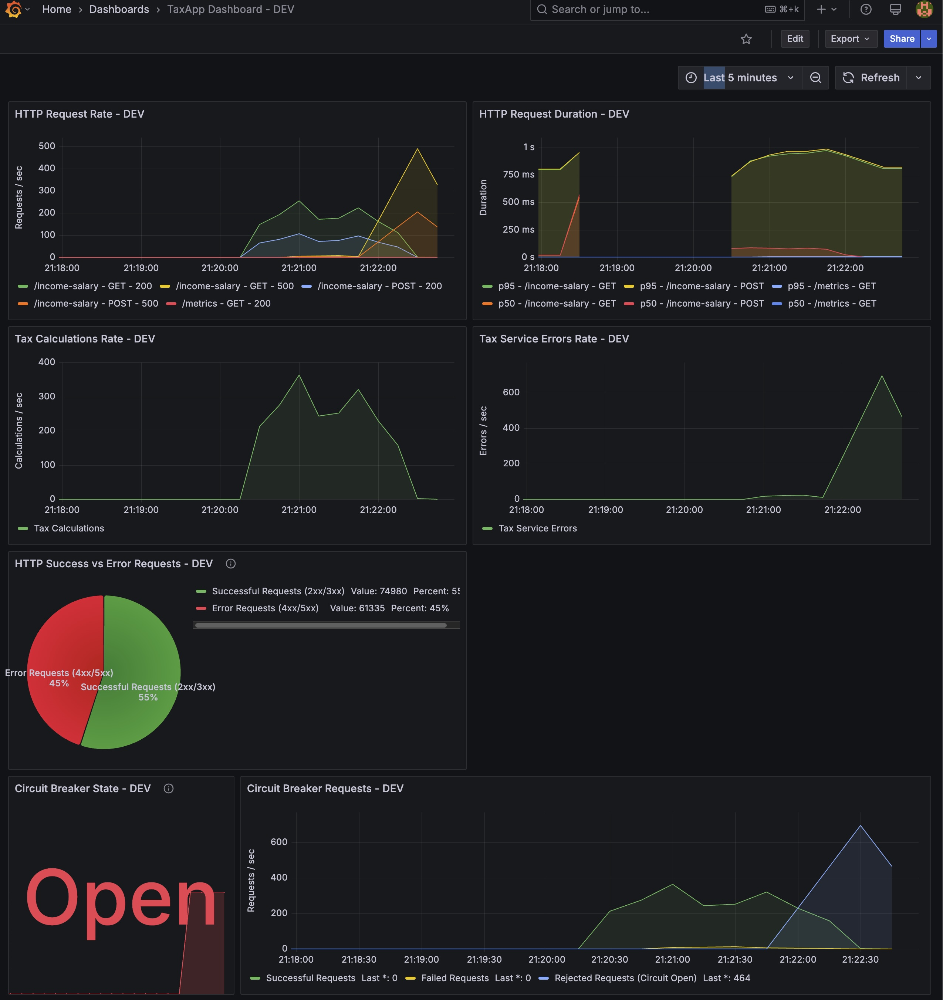
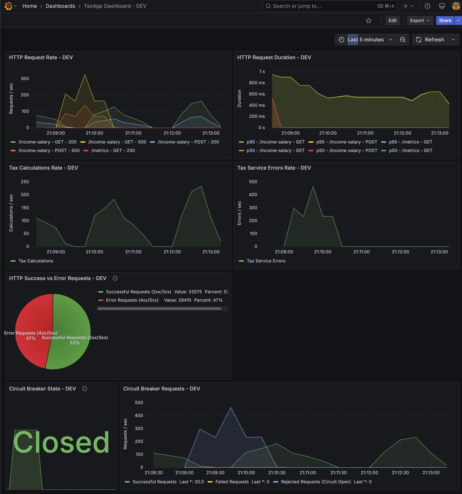

# TaxApp

[](https://github.com/dimaaash/pulsegrade-test1/actions/workflows/test.yml)
[](https://codecov.io/gh/dimaaash/pulsegrade-test1)

This application calculates tax based on salary information.

## Application Architecture

The TaxApp is designed with a modular architecture focused on resilience and observability. Below is the high-level architecture diagram:

```
+---------------------+                  +---------------------+
|                     |                  |                     |
|    Client Request   |                  |   Prometheus/       |
|                     |                  |   Grafana           |
+----------+----------+                  +----------+----------+
           |                                        ^
           v                                        |
+----------+----------+    Metrics      +-----------+---------+
|                     +---------------->+                     |
|   HTTP Server       |                 |   Metrics Service   |
|   (main.go)         |                 |                     |
+----------+----------+                 +---------------------+
           |
           v
+----------+----------+    Load Config   +---------------------+
|                     +----------------->+                     |
|   Handler           |                  |   Config Service    |
|   (income_handler)  |                  |                     |
+----------+----------+                  +---------------------+
           |
           |                             +---------------------+
           |                             |                     |
           +----------------------------->   Logger Service    |
           |                             |                     |
           |                             +---------------------+
           v
+----------+----------+
|                     |    Circuit       +---------------------+
|   Tax Calculator    |    Breaker      |                     |
|   Service           +----------------->+  External Tax Calc  |
|                     |                  |  Service API        |
+---------------------+                  |                     |
                                         +---------------------+
```

### Key Components:

1. **HTTP Server**: Entry point for client requests, handles routing and middleware
2. **Handler Layer**: Processes income-salary requests and formats responses
3. **Tax Calculator Service**: Core business logic with circuit breaker for resilience
4. **Config Service**: Manages application settings across environments
5. **Logger Service**: Provides configurable logging functionality
6. **Metrics Service**: Collects performance data and exposes Prometheus metrics
7. **External Tax Calculation API**: Third-party service for tax bracket information

### Request Flow:
- Client sends request to `/income-salary` endpoint
- Request processed through metrics middleware
- Handler extracts salary information and tax year
- Tax Calculator service calls external tax API (protected by circuit breaker)
- Tax calculation performed and response returned to client
- Metrics collected for monitoring in Grafana

## Resilience with Circuit Breaker Pattern

The TaxApp implements the Circuit Breaker pattern to improve resilience when dealing with unreliable external services.

### What is the Circuit Breaker Pattern?

The Circuit Breaker pattern prevents an application from repeatedly trying to execute an operation that's likely to fail, allowing it to continue operating without waiting for the fault to be fixed or wasting resources while the fault persists.



#### Circuit States

1. **Closed (Normal Operation)**:
   - Requests flow normally to the external service
   - Failures are monitored and counted
   - When failure threshold is exceeded, circuit trips to Open state

2. **Open (Service Isolation)**:
   - All requests to the external service are immediately rejected
   - Prevents cascading failures and gives the external service time to recover
   - After a timeout period, transitions to Half-Open state

3. **Half-Open (Recovery Testing)**:
   - Allows a limited number of test requests through
   - If successful, circuit closes and normal operation resumes
   - If failures persist, circuit returns to Open state

### Implementation Details

The TaxApp uses the [Sony GoBreaker](https://github.com/sony/gobreaker) library to implement the Circuit Breaker pattern for the external tax calculation service:



- **Threshold**: Circuit opens after 5 requests with ≥50% failure rate
- **Recovery**: After 60 seconds in Open state, circuit transitions to Half-Open
- **Monitoring**: Circuit state and performance metrics are tracked in Grafana dashboards

### Configuration

The Circuit Breaker's sensitivity can be adjusted in `services/tax_calculator.go` by modifying:
- Minimum request count before tripping (currently 5)
- Failure ratio threshold (currently 0.5 or 50%)
- Timeout duration before recovery testing (currently 60 seconds)

You can also enable or disable the Circuit Breaker pattern entirely through configuration:
- Add `circuitBreakerEnabled: false` to your config.yaml file to disable it
- The default setting is enabled (`circuitBreakerEnabled: true`)
- This can be overridden with the environment variable `TAXAPP_CIRCUITBREAKERENABLED=false`

### Stress Testing with Benchmark Tool

To properly test the Circuit Breaker pattern and ensure system resilience, you can use the included benchmark tool to simulate high traffic loads against your DEV environment:

```
go run benchmark/benchmark.go -n 10500 -c 10 -get 70 -o text
```

This command:
- Sends **10,500 requests** (`-n 10500`) to the tax application
- Uses **10 concurrent workers** (`-c 10`) to generate load in parallel
- Distributes requests as **70% GET** and 30% POST requests (`-get 70`)
- Outputs results in **text format** (`-o text`) for easy reading in the terminal

This volume of concurrent requests is designed to:
1. Stress test the application's handling of high traffic
2. Potentially trigger the circuit breaker if the tax service becomes slow or unresponsive
3. Measure performance characteristics under load (latency, throughput, error rates)

Running this test is particularly valuable for:
- Verifying the circuit breaker trips appropriately when failures occur
- Ensuring the system gracefully degrades under heavy load
- Measuring response times and throughput before system saturation
- Identifying performance bottlenecks in the application

**Note:** For testing the production environment, use similar parameters but target the production endpoint.

### Monitoring

The Circuit Breaker's behavior can be monitored through Grafana dashboards that show:
- Current circuit state (Closed, Half-Open, Open)
- Request rates (successful, failed, rejected)
- Failure percentages and response times

## Benchmarking and Stress Testing Tools

The project includes two powerful tools for benchmarking and stress testing the tax application:

### Go Benchmark Tool

Located at `benchmark/benchmark.go`, this command-line utility can send controlled volumes of requests to your tax application.

**Features:**
- Measures response times, throughput, and success/failure rates
- Supports customizing the mix of GET and POST requests
- Outputs detailed statistics in text or JSON format

**Usage:**
```
cd /Users/dmitrykuznetsov/Documents/repos/interviews/pulsegrade/test1
go run benchmark/benchmark.go -n 500 -c 20 -get 70
```

**Options:**
- `-n`: Total number of requests to send (default: 100)
- `-c`: Number of concurrent workers (default: 10)
- `-get`: Percentage of GET requests vs POST (default: 50%)
- `-min-salary`: Minimum salary to test (default: 10,000)
- `-max-salary`: Maximum salary to test (default: 1,000,000)
- `-min-year`: Minimum tax year (default: 2020)
- `-max-year`: Maximum tax year (default: 2025)
- `-v`: Verbose output
- `-o`: Output format ("text" or "json")


## Operating the Application

The TaxApp application can be run in two different environments: DEV and PROD, each with its own configuration and behavior.

### Starting the Application

#### DEV Mode
To start the application in DEV mode (default):
```
go run ./cmd/taxapp/main.go
```
DEV mode:
- Uses the configuration from `config.yaml`
- Runs on port 8080
- Connects to the external tax service at: `http://localhost:5001/tax-calculator`

#### PROD Mode
To start the application in PROD mode:
```
go run ./cmd/taxapp/main.go prod
```
PROD mode:
- Uses the configuration from `config.prod.yaml`
- Runs on port 8081
- Connects to the external tax service at: `http://localhost:5001/tax-calculator/tax-year/[2019|2020|2021|2022]`

### Dependencies and Supporting Services

To start the external tax service along with the Prometheus/Grafana monitoring stack:
```
docker compose up
```

This will launch:
- The external tax calculation service
- Prometheus for metrics collection
- Grafana for visualization dashboards

### Testing with HTTP Scripts

The repository includes pre-built HTTP request scripts for testing the application:

- `http_scripts/dev-income-salary.http` - For testing the DEV instance (port 8080)
- `http_scripts/prod-income-salary.http` - For testing the PROD instance (port 8081)
- `http_scripts/dev-tax-calc.http` - For direct tax calculation requests in DEV
- `http_scripts/prod-tax-calc.http` - For direct tax calculation requests in PROD

### Monitoring

Each environment (DEV and PROD) has its own dedicated dashboard in Grafana:
- DEV dashboard: `monitoring/grafana/provisioning/dashboards/taxapp_dashboard_dev.json`
- PROD dashboard: `monitoring/grafana/provisioning/dashboards/taxapp_dashboard_prod.json`

Once your application and Docker services are running, access the Grafana dashboards to monitor performance metrics, circuit breaker status, and system health.
